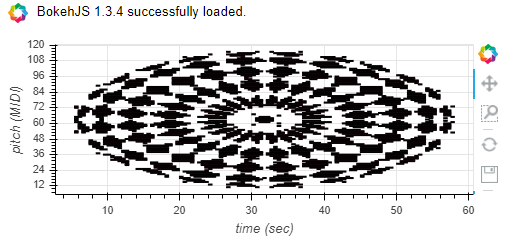

## img2midi

Convert images to midi.

## Usage

Example image used

	
	import img2midi
	i2m = img2midi.ImgToMidi()
	
	# Load an image and convert to midi.
	i2m.open_image(image_path='PATH_TO_IMAGE')
	i2m.make_midi()
	i2m.plot()

To save as midi file.

	i2m.save_midi() # Default midi name `img2midi` if no filename provided
	
	
## Experimental 

We will try to generate something that can sound pleasant in midi form, extracted from an Image.
Given the midi generated the musical expierience unfortunately is unpleasant due to the full range of notes stacked on each other.

For the experimental part the below image will be used.

Using the same code above we get the resul below. As you can see due to the midi range limitation of 127 notes the image/midi notes become greatly compressed

We can set the default image size to be ignored and only work with a specific part of the Image. (This currently selects at random choice)

	# Ignore default size.
	i2m.default_size = False
	i2m.make_midi()
	i2m.plot()
	

The midi notes now resemble a higher quality part of the original image. However this still does not sound pleasant. We should also take in account that almost no music contains a full range of notes from 0 to 127 per track

To change this we can set the starting note, and the range of notes we want to use.

	# Set starting note and range.
	i2m.default_size = False
	i2m.midi_start_note = 36 # Set a starting note. C2
	i2m.midi_range = 24 # The range of notes we want to have.
	i2m.make_midi()
	i2m.plot()
	

Now that we have our starting note and range we have to tackle our anti-harmony problem. Notes stacked on each other just sound like horror film soundtracks. We can apply a step skip the will ignore a given set of notes.
For example if we set the steps to 2, every midi note will have a space of 2 between them and so on.
	
	# Apply skip between notes.
	i2m.default_size = False
	i2m.midi_start_note = 36
	i2m.midi_range = 24
	i2m.make_midi(skip=3) # Set the amount of notes to skip.
	i2m.plot()
	

