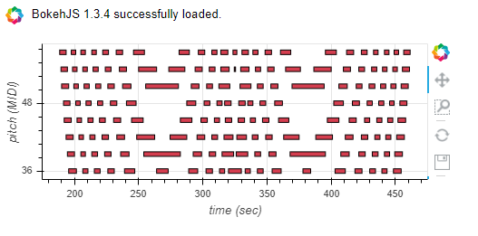

## img2midi

Convert images to midi.
This library converts the input images to black & white, and transforms the black section to midi. Works best with illustrations.

## Installation

	pip install git+https://github.com/danikavu/img2midi.git

## Usage

Example image used

	
	import img2midi
	i2m = img2midi.ImgToMidi()
	
	# Load an image and convert to midi.
	i2m.open_image(image_path='PATH_TO_IMAGE')
	i2m.make_midi()
	i2m.plot()

To save as midi file.

	i2m.save_midi() # Default midi name `img2midi` if no filename provided
	
	
## Experimental 

We will try to generate something that can sound pleasant in midi form, extracted from an Image.

For the experimental part the below image will be used.

Using the same code above we get the result below. As you can see due to the high quality of detail in the image in addition with the midi range limitation of 127 notes, the image/midi notes become greatly compressed.

We can set the default image size to be ignored and only work with a specific part of the Image. (This currently selects at random choice)

	# Ignore default size.
	i2m.default_size = False
	i2m.make_midi()
	i2m.plot()
	

Set a starting note on 36 and a note range of 24. The range will apply from the starting note and above.

	# Set starting note and range.
	i2m.default_size = False
	i2m.midi_start_note = 36 # Set a starting note. C2
	i2m.midi_range = 24 # The range of notes we want to have.
	i2m.make_midi()
	i2m.plot()
	

We can apply a step skip the will ignore a given set of notes.
For example if we set the steps to 2, every midi note will have a space of 2 between them and so on.
	
	# Apply skip between notes.
	i2m.default_size = False
	i2m.midi_start_note = 36
	i2m.midi_range = 24
	i2m.make_midi(skip=3) # Set the amount of notes to skip.
	i2m.plot()
	

We can shift the notes to start at zero using the `midi_modifier()` function. We can then quantize the midi notes using the `stretch()` function to fit in bar view. Finally we will apply via the `midi_modifier()` function to add fluctuation and the amount we want to shift notes up or down.
We can also set every step we want the midi shift to apply. The amount of shift per step is selected at random.
	
	# Usually we should shif all the notes until the first note starts at zero.
	i2m.midi_modifier(start_zero=True)
	# Stretch or quantize midi. Default value is 16.
	i2m.stretch() # If you want to change the value the bars argument is used. ex bars=8
	# Apply shifting of notes and the amount of times.
	i2m.midi_modifier(s_stretch=[-2,2], # Add the shift range in the s_stretch argument.
					  scale_change=8)   # Apply shift changes 8 times. For 16 it will shift every 2 bars. 16/8
	i2m.plot()
	
